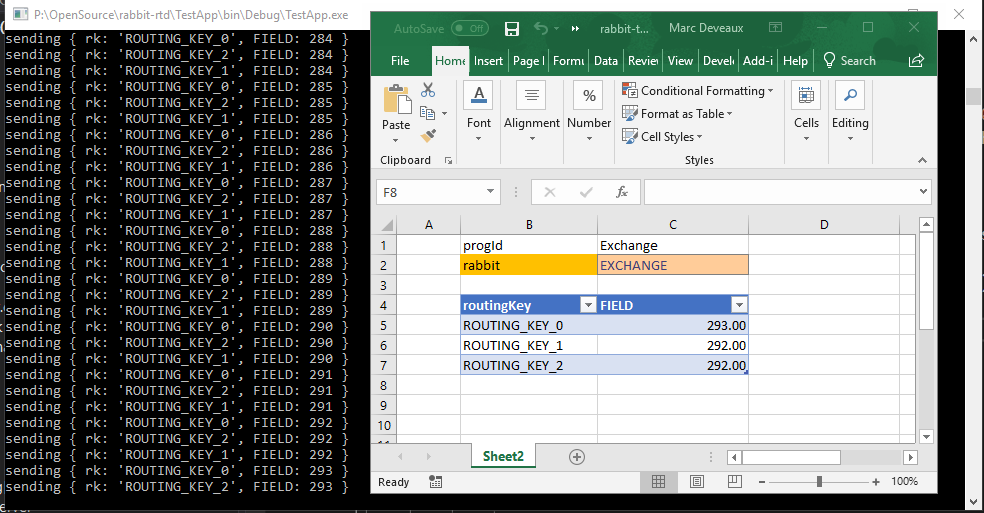

# rabbit-rtd
Excel RTD server sourcing data from Rabbit-MQ

## Installation
1. Clone the repository and go to its folder.
2. Compile the code using Visual Studio, MSBuild or via this handy script file:

   `build.cmd`

3. Register the COM server by running the following script in admin command prompt:
   
   `register.cmd`

## Usage

Once the RTD server has been installed, you can use it from Excel via the RTD macro.
This is the syntax:

`=RTD("rabbit",, "HOST", "EXCHANGE", "ROUTING_KEY")`   // returns whole message as a string
`=RTD("rabbit",, "HOST", "EXCHANGE", "ROUTING_KEY", "FIELD")`  // requires JSON formatted messages

EXCHANGE should be declared as type: "topic", autoDelete: true

[]

